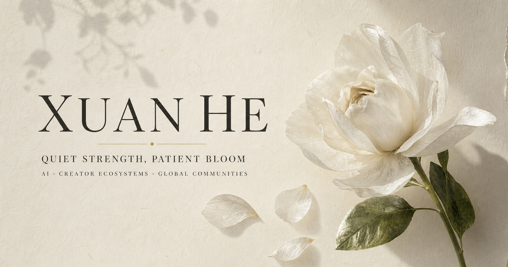

# Xuan He — Interactive Gardenia Portfolio

[**Open the live interactive website →**](https://jack-3d-creator.kittyxuaxuan.chatgpt.site/)



An interactive personal portfolio for Xuan He (Kitty), built as a quiet digital
garden. The experience combines editorial typography, a blooming gardenia,
scroll-driven storytelling and restrained WebGL fluid transitions.

## Highlights

- Interactive gardenia bloom with drifting platinum-edged petals
- Fraunces variable-font title with a one-time metallic light sweep
- WebGL fluid shader transitions between portfolio sections
- GSAP ScrollTrigger timelines for Experience, Projects and Skills
- Drag, wheel, touch and keyboard interaction
- Responsive mobile and reduced-motion fallbacks
- Dedicated résumé and GEO/GTM project routes
- English content throughout

## Routes

- `/` — interactive portfolio
- `/resume` — web résumé with access to the original PDF
- `/projects/fenz-geo-gtm` — GEO/GTM web deck

## Local development

Requirements: Node.js `>=22.13.0`.

```bash
npm install
npm run dev
```

Open the local URL printed in the terminal.

## Production build

```bash
npm run build
```

## Stack

React, TypeScript, vinext, Three.js, GSAP, Framer Motion and Tailwind CSS.

## Content rights

The repository is public for portfolio review and technical reference.
Personal photographs, résumé content and original written material remain the
property of Xuan He. Forks cannot modify this original repository unless
explicit collaborator access is granted.
